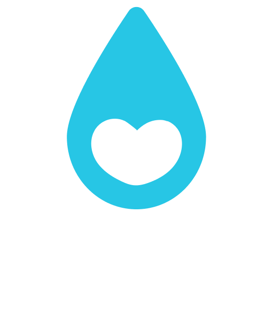

  
  
  # 💧 HydraTime
  
  ### Stay Hydrated, Stay Healthy - It's Time to Hydrate
  
  

    A smart, elegant water reminder and tracking app built with Flutter
     
    <a href="#features"><strong>Explore Features »</strong></a>
     
     
    <a href="#screenshots">View Screenshots</a>
    ·
    <a href="#installation">Installation</a>
    ·
    <a href="https://github.com/sagardhadke/hydra_time/issues">Report Bug</a>
    ·
    <a href="https://github.com/sagardhadke/hydra_time/issues">Request Feature</a>
  

## 📖 About The Project

**HydraTime** is a comprehensive water tracking and reminder application designed to help users maintain optimal hydration levels throughout the day. Built with Flutter and following Clean Architecture principles, HydraTime provides a seamless, intuitive experience for monitoring water intake and receiving timely reminders.

### 🎯 Why HydraTime?

- 💧 **Smart Hydration Tracking** - Track your daily water intake with beautiful visual feedback
- ⏰ **Intelligent Reminders** - Customizable interval and time-based reminders
- 📊 **Detailed Analytics** - View comprehensive statistics and track your progress
- 🎨 **Beautiful UI** - Modern, intuitive interface with dark and light themes
- 🔒 **Privacy First** - All data stored locally with no account required
- 🚀 **Fast & Reliable** - Built with performance and scalability in mind

## ✨ Features

### 🌟 Core Features

#### 💧 Water Tracking
- **Visual Progress Indicator** - Beautiful wave animation showing daily progress
- **Quick Add** - Add water intake with a single tap
- **Custom Amounts** - Flexible slider to add any amount of water
- **Daily Goals** - Personalized hydration targets based on your profile
- **Auto Reset** - Automatic daily progress reset at midnight
- **Achievement Celebrations** - Celebrate when you hit your daily goal

#### ⏰ Smart Reminders
- **Interval Reminders** - Get reminded every X minutes (15, 30, 45, 60, 90, 120 mins)
- **Specific Time Reminders** - Set reminders for specific times of day
- **Custom Messages** - Choose from pre-defined or create custom reminder messages
- **Filter & Sort** - Easily filter reminders by type
- **Swipe to Delete** - Quick gesture-based reminder management
- **Rich Notifications** - Engaging notification content with emojis

#### 📊 Statistics & Analytics
- **Daily Stats** - View today's water intake at a glance
- **Weekly Overview** - Track your hydration patterns over the week
- **Monthly Reports** - Comprehensive monthly hydration analysis
- **Streak Tracking** - Monitor consecutive days of achieving goals
- **Beautiful Charts** - Interactive graphs powered by FL Chart
- **Achievement Badges** - Earn badges for milestones
- **Export Data** - Download your hydration history

#### 👤 Personalized Experience
- **Custom Onboarding** - Smooth, informative first-time experience
- **Personal Profile** - Set your age, weight, height, and activity level
- **Activity-Based Goals** - Recommendations based on your lifestyle
- **Climate Adjustment** - Hydration needs adjusted for your climate
- **Daily Routine** - Set wake-up and bedtime for smart reminders

#### 🎨 Themes & Customization
- **Dark Mode** - Easy on the eyes (default)
- **Light Mode** - Bright and clean interface
- **System Theme** - Auto-switch based on system preference
- **Smooth Transitions** - Seamless theme switching
- **Custom Colors** - Beautiful cyan accent color throughout

#### ⚙️ Settings & More
- **Profile Management** - View and edit your personal information
- **Notification Control** - Manage all notification preferences
- **Data Export/Import** - Backup and restore your data
- **Privacy Policy** - Transparent about data handling
- **About Section** - App info, version, and developer details